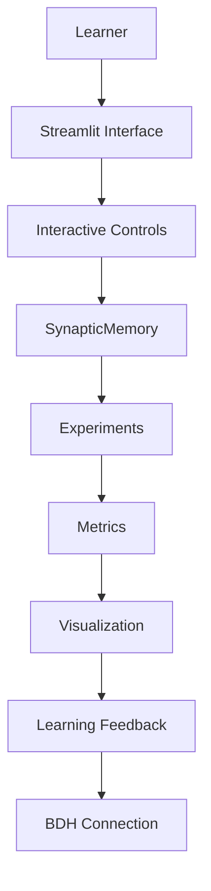

# SynaptiLab

## Overview

SynaptiLab is an educational simulation project about how temporary changes in synaptic state may support short-term memory. It is designed to help learners explore plasticity, recall, decay, and interference through interactive experiments.

## Central Question

> Can a changing synaptic connection act as short-term memory?

## Central Claim

> A Hebbian synaptic update can store a recently observed association in connection strengths, allowing the association to be recalled after the original input disappears, while decay and interference limit how long that memory remains reliable.

This is the claim of a planned simplified educational model. It is not a claim that this repository is a complete implementation of BDH.

## Why This Matters

The project connects synaptic plasticity, short-term memory, and inference-time memory as related educational ideas. It will also introduce the Dragon Hatchling / BDH concept, while clearly distinguishing research-backed claims, the mathematical simplification used here, project experiments, and the actual mechanism described in the literature.

## Planned Interactive Experience

Learners will move from a question to an interaction, observe a change in synaptic state, connect that observation to an equation, run experiments, examine the BDH connection, consider limitations, and complete a challenge.

## Architecture



## Experiments

1. Plasticity OFF vs ON
2. Memory decay over time
3. Repeated learning
4. Interference between associations
5. Recall after delay

These are plans only; no scientific results are reported yet.

## Technology

- Python 3.11+
- NumPy
- Matplotlib
- Plotly
- Streamlit
- pytest
- Git/GitHub
- Markdown

## Installation

```bash
python -m venv .venv
```

Windows:

```powershell
.venv\Scripts\activate
```

Linux/macOS:

```bash
source .venv/bin/activate
```

```bash
pip install -r requirements.txt
```

## Running the Application

```bash
streamlit run app.py
```

The application is currently a working placeholder and is under development.

## Running Tests

```bash
pytest
```

The current tests verify setup surfaces only. Behavioral tests will be added after `SynapticMemory` is implemented.

## Project Structure

- `core/`: Streamlit-independent simulation components
- `experiments/`: reproducible experiment entry points
- `visualization/`: planned plots and network views
- `pages/`: Streamlit learning journey pages
- `tests/`: automated tests
- `docs/`: project, architecture, science, and experiment documentation
- `references/`: verified scientific citations
- `notebooks/`: exploratory teaching material

## Scientific Foundation

See `docs/science/` and `references/references.md`. Citations will be added only after verification.

## Limitations

The initial model is intentionally simplified and must not be presented as a complete biological model or complete BDH implementation. See `docs/science/limitations.md`.

## AI Disclosure

See [AI_DISCLOSURE.md](AI_DISCLOSURE.md).

## Team

- Person 1 — Scientific Research & BDH
- Person 2 — Simulation & Experiments
- Person 3 — Interactive UI & Visualization
- Person 4 — Integration & QA

## Next Milestone

**Milestone 1 — Implement SynapticMemory + Plasticity Experiment + Decay Experiment.**
