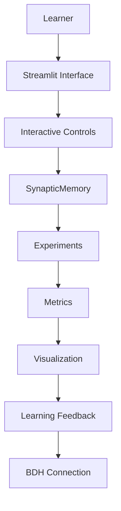

# Architecture

SynaptiLab is organized so that the educational interface remains separate from the lightweight simulation core.

## Planned Layers

- **Learner:** observes a question, changes controls, and interprets feedback.
- **Streamlit UI:** presents the educational sequence and experiment controls.
- **Interactive controls:** configure activity, learning rate, retention, delay, and interference.
- **SynapticMemory:** owns the simplified synaptic state and its separate learning and decay operations.
- **Experiments:** run reproducible comparisons without depending on Streamlit.
- **Metrics:** quantify recall, retention, and interference after the model is implemented.
- **Visualization:** renders matrices, network state, and experiment curves.
- **Learning feedback:** connects observed behavior to equations and limitations.

## Future BDH Educational Layer

A future educational layer will explain how the simplified model relates to the Dragon Hatchling / BDH concept described in the research literature. It must label analogies, simplifications, and differences explicitly. The project will not claim that `SynapticMemory` is a complete BDH implementation.

## Dependency Direction

The core model should not import Streamlit. Experiments should call the core model and return data suitable for metrics and visualization. The UI may compose all layers, but the scientific code must remain testable from Python and pytest alone.
